# General Portfolio
This is the shared portfolio for all of us, containing the parts of the portfolio that don't differ between members of the group

## A description of the project requirements and constraints
The goal for this project was to make a device which would differentiate, sort, and count widgets based on if they have holes or not. [Good widgets](CAD/stl-files/good-widget.stl) are 3-dimensional rectangular shapes that have an off centered hole going through them and bad widgets are missing a hole. We have to load 5 good and 5 bad widgets at random and the sorter needs to count them, sort them, and know when it is done counting them after a single button press. 

## An outline of your project
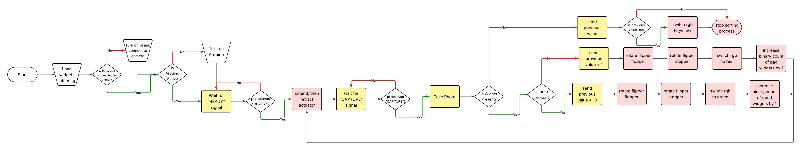

## A wiring diagram - this could be hand drawn, made using software, a tinkerCAD link, etc

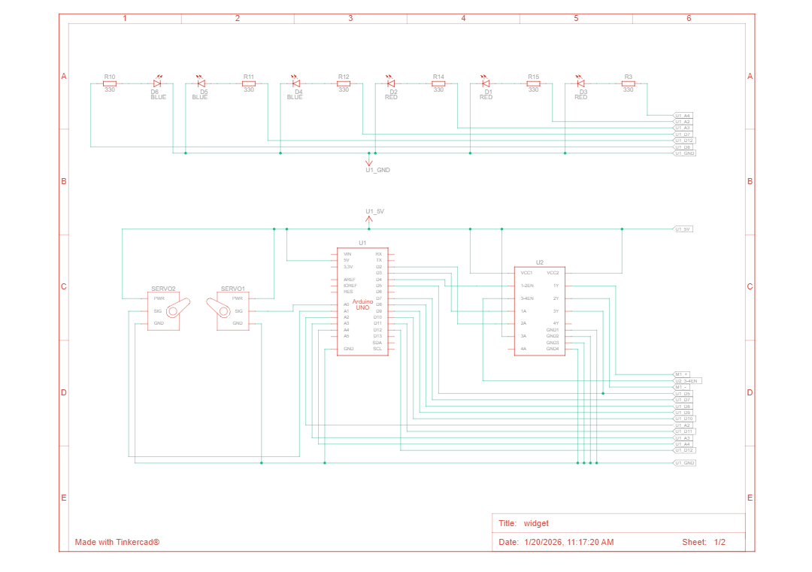

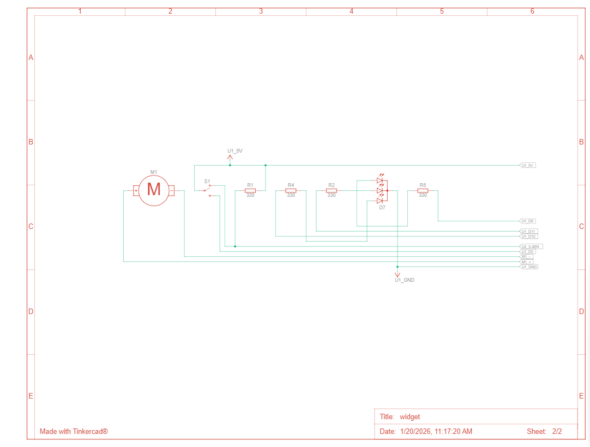

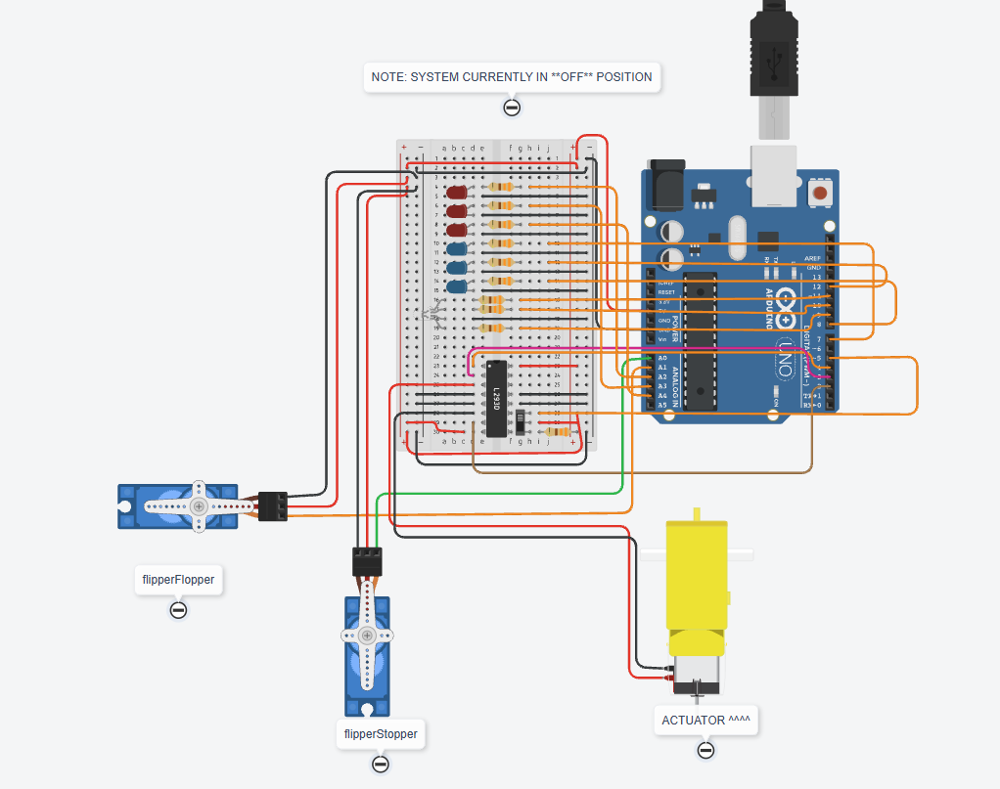

## A set of mechanical drawings showing components, assembly, and hardware.
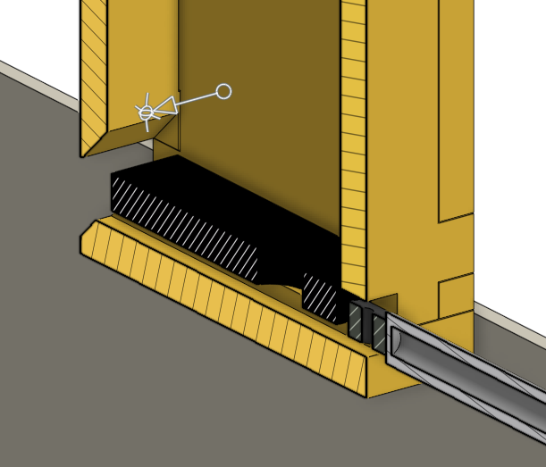

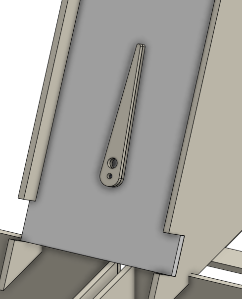

## A parts list
- Camera 
- Raspberry Pi
- Keyboard 
- Mouse
- Monitor
- [100mm Linear actuator](https://www.amazon.com/Electric-High-Speed-sec-Weight-Intelligent-Automation/dp/B07ZJ46947/ref=sr_1_14?th=1) 
- 2 Servo Motors
- Mounting hardware (various metric bolts)
- PLA for the prints
- 3mm wood or mdf for structure
- Arduino
- Breadboard 
- Switch 
- 3 red and 3 blue LED
- RGB LED
- Switch 
- Motor controller
- Many wires w/ Dupont connectors

## A program including header and comments
[Widget Detection Pi Code](code/widget_inspector.py)  
[Arduino Code](code/motor_control.ino)

## Any CAD models used in the project - include screen captures and a link to your drawing files
### [Onshape Link](https://cad.onshape.com/documents/1959d45d93e06fd605dded79/w/4b29a523473d3687186c98d2/e/b105ef3a0426237b67d9fdd4)  
[STL Files](CAD/stl-files)  
[Laser Cut Files](CAD/laser-files)  
[CNC Files](CAD/cnc-files)

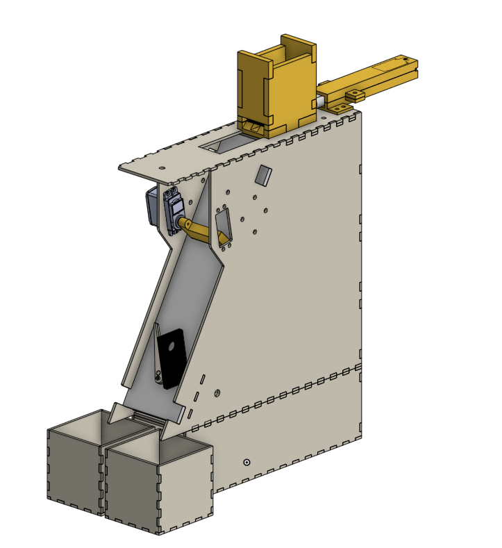

## Photos of the project
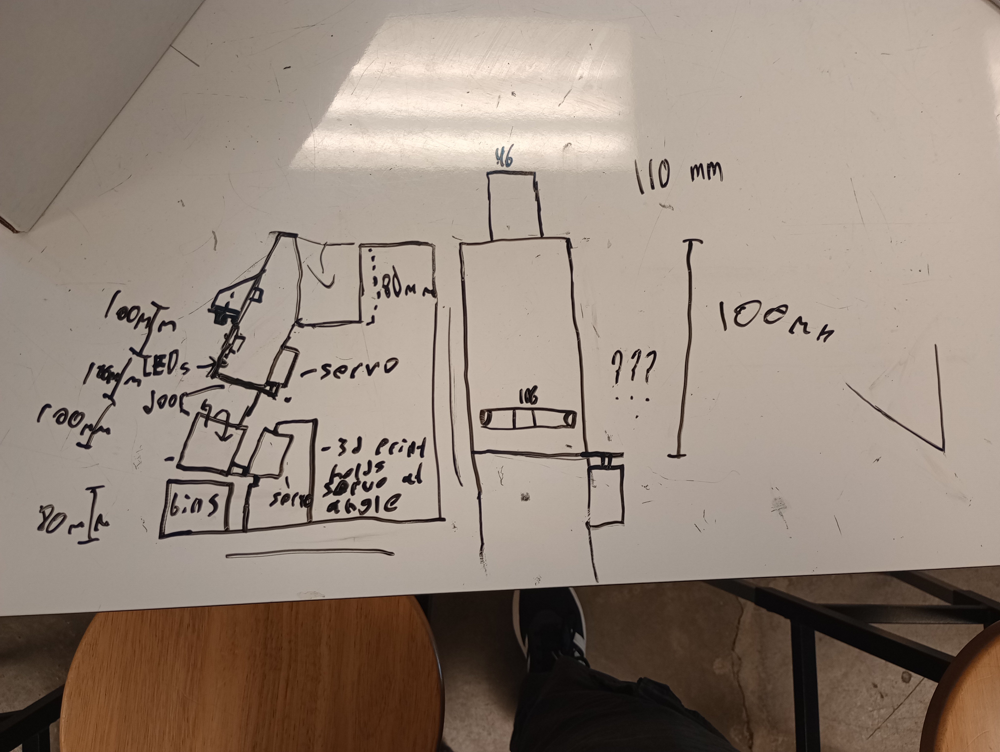

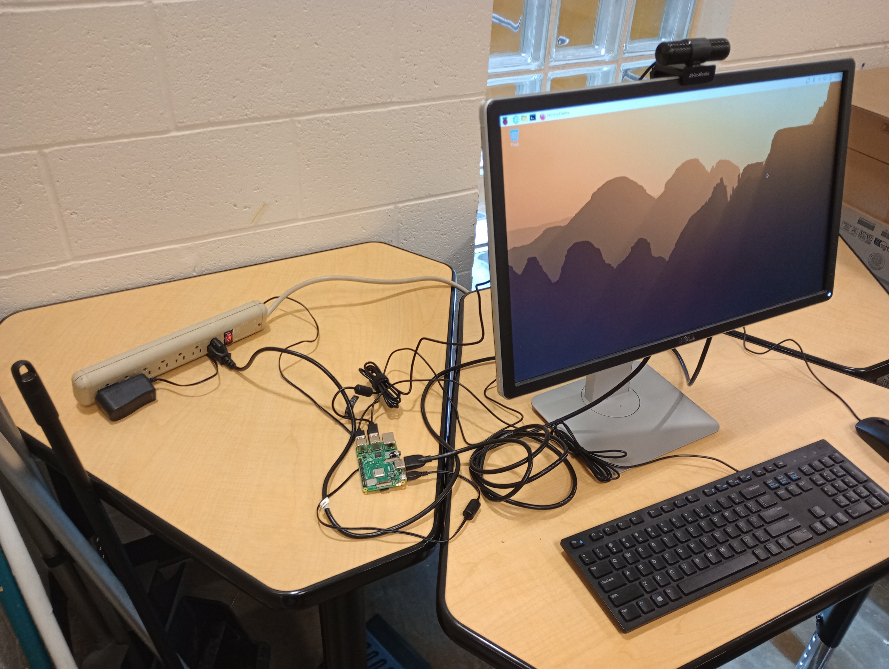

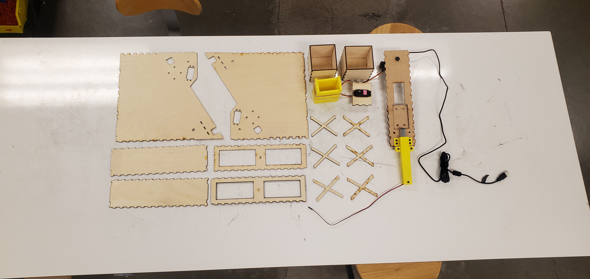

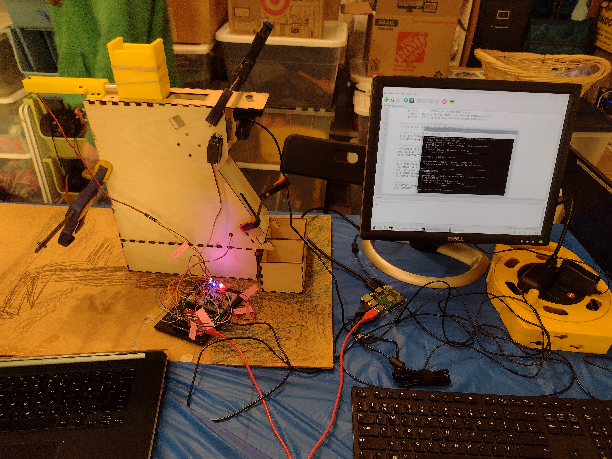

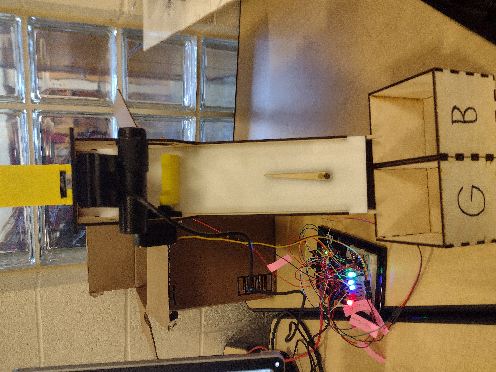
## A video of it working

## Reflections
[Markus Walker](Markus/markus-walker-reflection.md)

[Noah Grimes](Noah/noah-grimes-reflection.md)

[Yarema Mushkevych](Yarema/yarema-mushkevych-reflection.md)

## Any needed citations of sources

[Tinkercad Circuits Designer](https://tinkercad.com/circuits)

[Claude Sonnet](https://claud.ai)

[Arduino Forum](https://forum.arduino.cc)

[Onshape](https://cad.onshape.com)

[Download link for Arduino IDE](https://support.arduino.cc/hc/en-us/articles/360019833020-Download-and-install-Arduino-IDE)

[Thonny Download](https://thonny.org/)

[KDE Connect Download](https://kdeconnect.kde.org/download.html)

[Python Download](https://www.python.org/)

